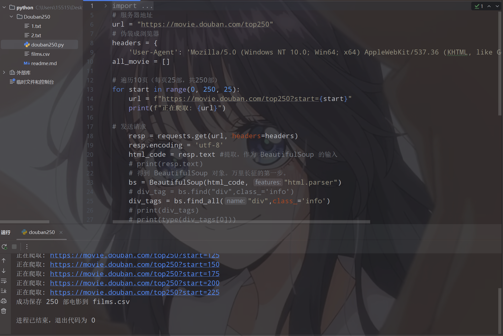
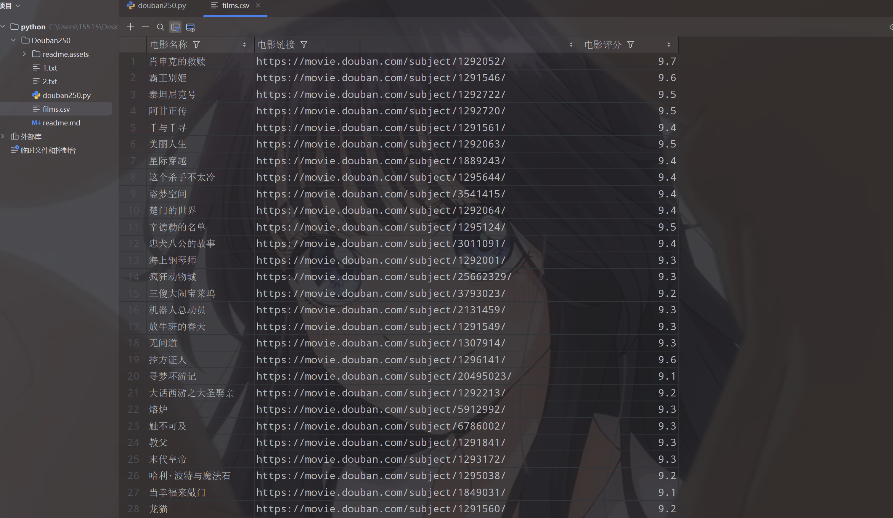
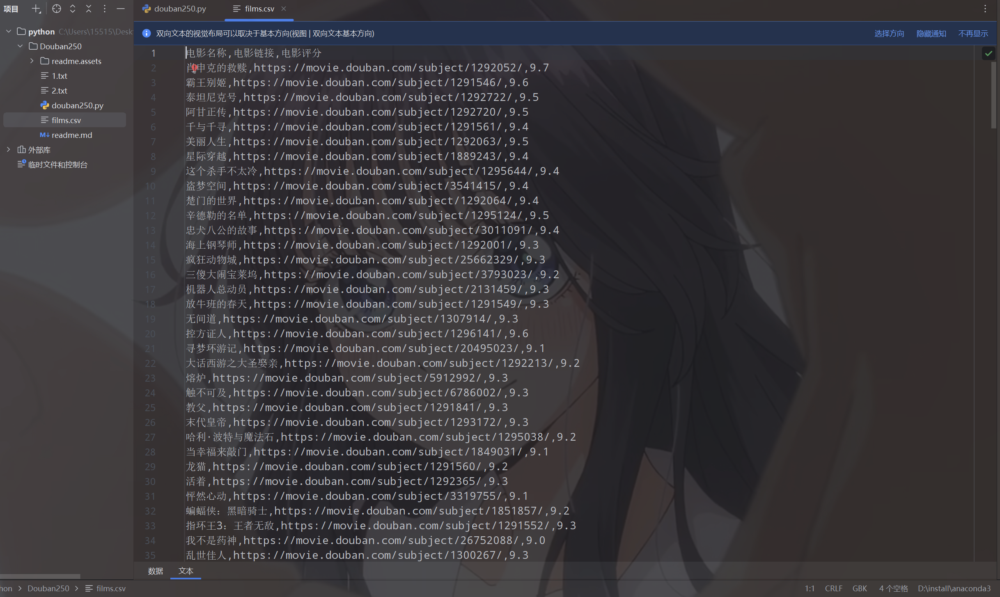
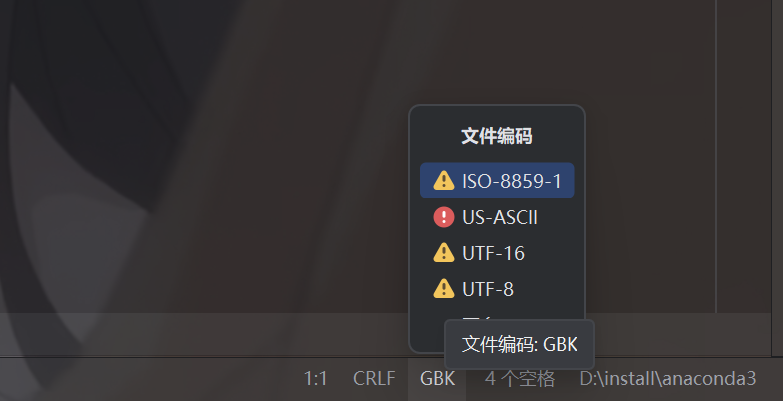
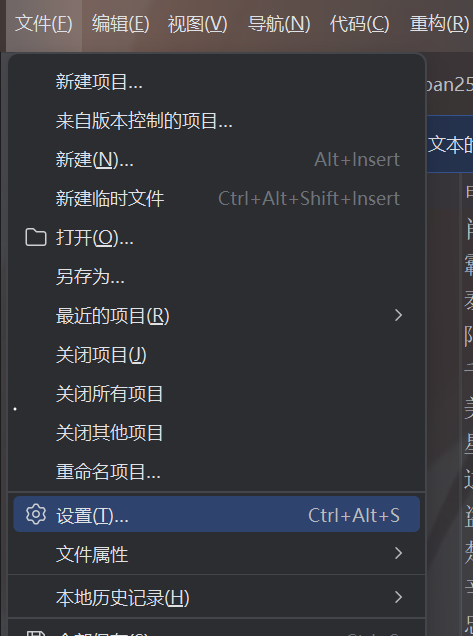
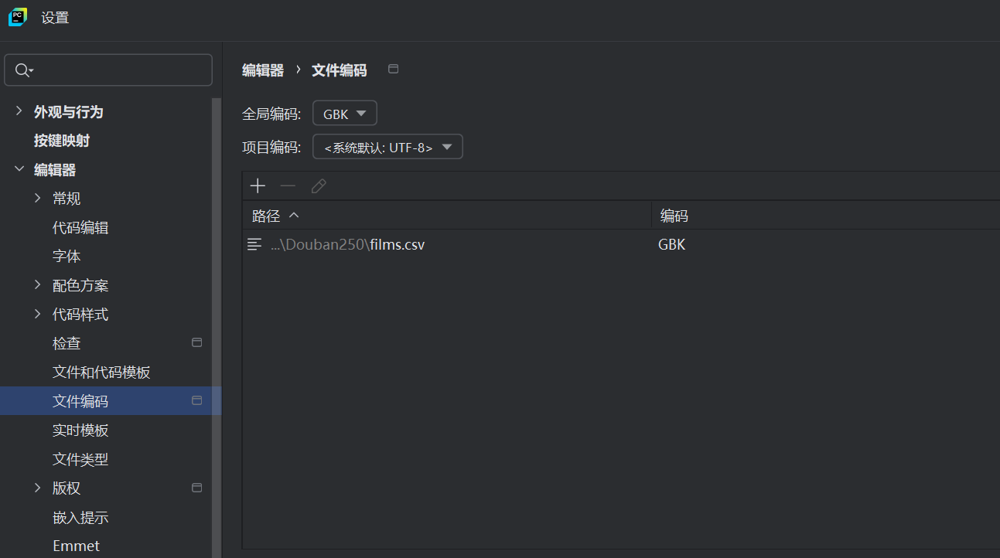

# 豆瓣250电影名称和评分爬取

---

## 项目概述 

这是一个使用Python编写的简单爬虫程序，用于抓取豆瓣电影Top250的基本信息，包括电影名称、详情链接和评分，并将数据保存到CSV文件中。个人学习用于练手

---

## 技术要点 

### 环境要求

- Python 3.x
- 稳定的网络

### 需要安装的库

pip install beautifulsoup4

pip install requests

### 技术栈

- **BeautifulSoup4**：HTML解析库，用于提取网页数据
- **Requests**：HTTP库，用于发送网络请求
- **CSV**：Python内置库，用于数据存储
- **Time**：Python内置库，用于控制爬取频率

---

## 爬虫实现原理

### 1. 请求伪装

```
headers = {
    'User-Agent': 'Mozilla/5.0 (Windows NT 10.0; Win64; x64) AppleWebKit/537.36'
}
```


- 通过设置User-Agent伪装成浏览器请求
- 避免被服务器识别为爬虫程序

### 2. 分页爬取策略

- 豆瓣Top250共10页，每页25部电影
- URL规律：`https://movie.douban.com/top250?start={start}`
- start参数从0开始，每页递增25
- 使用for循环遍历所有页面

### 3. 数据提取方法

- 使用BeautifulSoup解析HTML
- 定位`class="info"`的div标签作为电影信息容器
- 在每个容器中提取：
  - **电影名称**：`span[class="title"]`标签内容
  - **电影链接**：`a`标签的href属性
  - **电影评分**：`span[class="rating_num"]`标签内容

### 4. 反爬虫策略

python

```
time.sleep(1)  # 每爬取一页后等待1秒
```


- 添加延时控制爬取频率
- 降低被服务器封禁的风险

### 5. 数据存储

- 使用csv模块写入文件
- 文件名为`films.csv`
- 包含表头：`["电影名称","电影链接","电影评分"]`
- 采用`newline=''`参数避免写入多余空行

---

### 展示代码运行结果








若遇到输出内容中包含乱码时，在pycharm右下角更换文件编码格式




也可在设置中更换





当然，记得要点击  ==应用==

---


