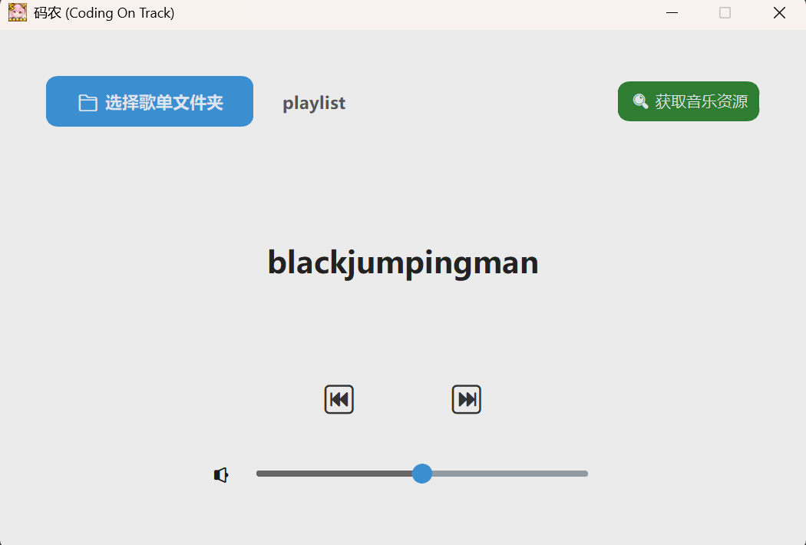
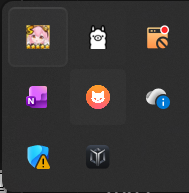

# 码农 (Coding On Track) - 沉浸式打字音乐播放器


**码农 (Coding On Track)** 是一款专为开发者设计的“沉浸式”音频播放器。它的核心理念是：**让音乐跟随你的代码律动。** 

当你开始敲击键盘时，音乐响起；当你停下思考或休息时，音乐自动暂停。

## ✨ 核心功能 (v1.0)

- **心流模式 (Flow Mode)**：键盘输入即播放，停止输入 2 秒后自动暂停，帮你快速进入编码状态。当然，也同样可以运用于游戏或其他场景，期待你发掘独特的场景利用
- **现代化 UI**：基于 `customtkinter` 打造的深色/浅色自适应简洁界面。
- **系统托盘支持**：支持最小化到系统托盘，不占用任务栏空间，支持切歌。
- **记忆功能**：自动记录上次使用的歌单文件夹，打开即用。
- **资源导航**：内置快捷获取音乐资源的入口，方便补给你的曲库。
- **轻量化**：仅需极低内存占用，后台静默守护。

## 🚀 快速开始

### 1. 安装依赖
确保你已安装 Python 3.8+，然后在终端执行：
```bash
pip install customtkinter pynput pygame pillow pystray
```


### 在文件夹ECTwork中下载  Coding On Track.zip  并解压即可使用码农.exe

内附使用说明txt文件，请先阅读文件再进行使用。

---

### 目前项目仅只完成1.0版本，后续优化还在进行

- 1.0版本使用界面



- 最小化




