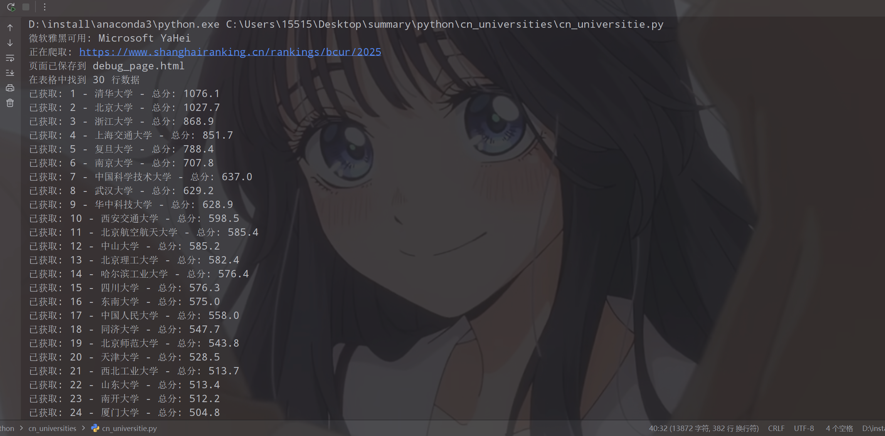
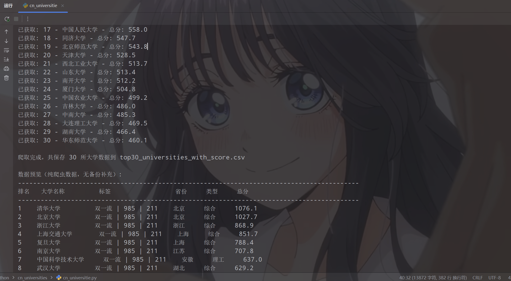
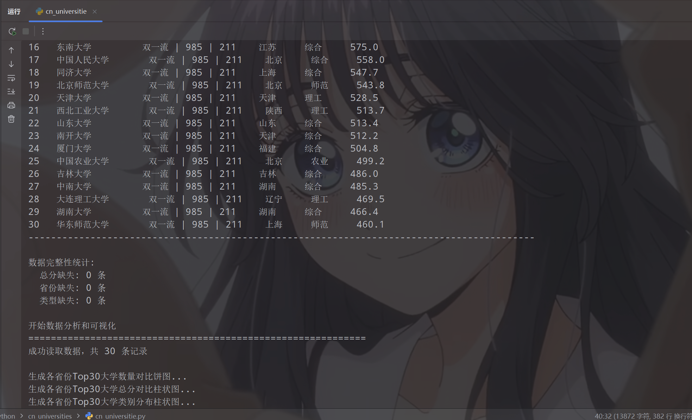
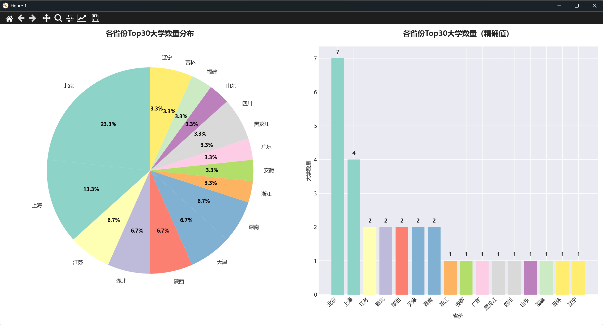
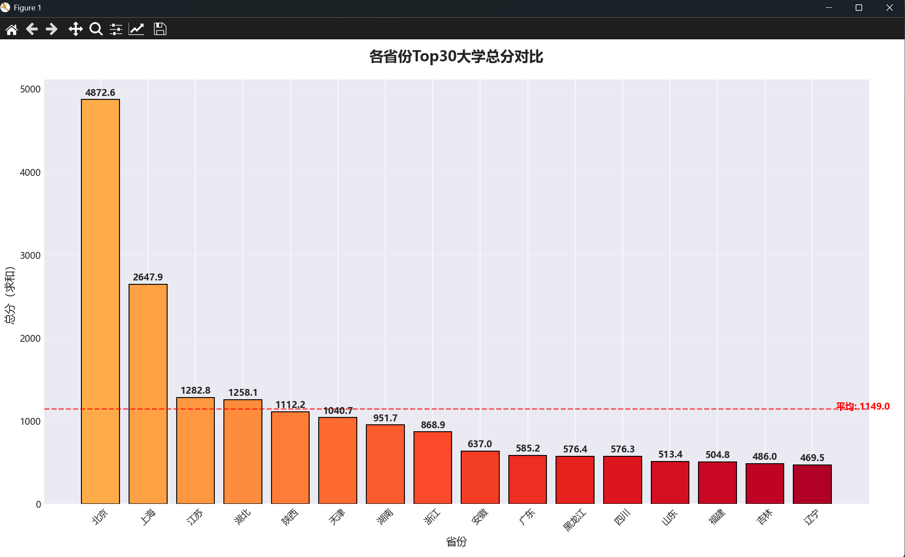
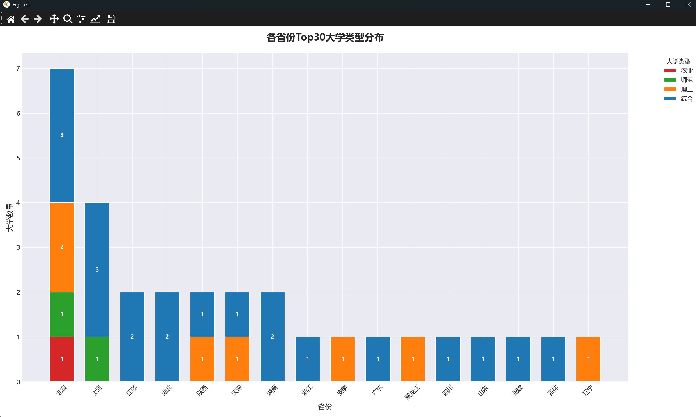

# 中国排名前30大学爬取与所在省份统计+结果可视化表达

---

## 项目概述 

这是一个使用 Python 编写的爬虫与数据分析程序，用于抓取中国大学前30的基本信息（包括大学名称、大学类别、大学综合得分和所在省份，以及“985/211/双一流”标签），并将数据保存到 CSV 文件中。随后使用 Pandas 对数据进行清洗和分类统计，最终通过 Matplotlib 实现直观的数据可视化表达。本项目非常适合作为个人学习 Python 爬虫与数据分析的总结项目。 

## 技术要点 

### 环境要求

- Python 3.x
- 稳定的网络连接

### 需要安装的库

pip install beautifulsoup4

pip install requests beautifulsoup4 pandas numpy matplotlib

### 技术栈

- **Requests**：HTTP 请求库，用于向目标网站发送网络请求并获取网页源代码。
- **BeautifulSoup4**：HTML 解析库，用于解析网页的 DOM 结构并精准提取表格数据。
- **Re (正则表达式)**：Python 内置库，用于字符串匹配，在本代码中作为 BS4 解析失败时的**备用双重保障机制**。
- **Pandas & NumPy**：强大的数据处理与分析库，用于读取 CSV 数据、处理缺失值（N/A）、数据分组求和及交叉统计。
- **Matplotlib**：数据可视化核心库，结合 Seaborn 暗色主题，用于生成饼图、柱状图和堆叠柱状图。

---

## 爬虫实现原理

### 1. 请求伪装

```
headers = {
    'User-Agent': 'Mozilla/5.0 (Windows NT 10.0; Win64; x64) AppleWebKit/537.36 (KHTML, like Gecko) Chrome/120.0.0.0 Safari/537.36',
    'Accept': 'text/html,application/xhtml+xml,application/xml;q=0.9,image/avif,image/webp,*/*;q=0.8',
    'Accept-Language': 'zh-CN,zh;q=0.9',
    'Referer': 'https://www.shanghairanking.cn/',
    'Connection': 'keep-alive',
}
```

- 通过设置详尽的 Headers 参数伪装成真实的浏览器请求。

- 携带了 Referer 和完整的 Accept 字段，有效避免被服务器识别为机器人爬虫程序从而遭到拦截。2. 分页爬取策略

   

###  2.爬取目标以及策略

- **目标网站URL**：https://www.shanghairanking.cn/rankings/bcur/2025（软科中国大学排名榜单）。
- **提取策略**：不采用复杂的分页遍历，而是直接锁定总榜单页面。设置计数器 count，在遍历网页表格行时，一旦成功解析获取到前 30 所大学的有效数据即主动 break 终止解析，提高程序运行效率。

###  3.数据提取方法

- **常规 DOM 解析**：使用 BeautifulSoup 定位 <table class="rk-table"> 以及其内部的 <tr> 和 <td> 标签，按列索引抓取排名、校名、省份、类型和总分。
- **动态标签生成**：在解析大学名称时，通过匹配名称节点内的文本，自动提取该校是否具备 双一流 | 985 | 211 等重点标签。
- **正则备用方案（亮点）**：代码内置了容错机制。如果常规的 BS4 提取因为网页结构微调导致抓取数量不足 30 条，程序会自动回退到使用**正则表达式 (Regex)** 进行源码级深度匹配（re.findall），确保数据获取的完整性

### 4. 异常处理以及防护应用

python

```
resp = requests.get(url, headers=headers, timeout=15)
resp.raise_for_status()
```


- 增加 timeout=15 超时限制，防止程序在网络波动时无限期挂起（死锁）。
- 爬取网页后，立即将原始 HTML 源码保存为 debug_page.html 文件。如果发生爬取异常，开发者可以直接通过本地文件排查网站前端结构是否发生了变化。

### 5. 数据存储

- 使用 Python 内置的 csv 模块将提取到的列表数据直接写入本地。
- 文件命名为 top30_universities_with_score.csv。
- 采用了 utf-8-sig 编码格式保存文件，完美解决了使用 Microsoft Excel 打开 CSV 文件时常见的中文乱码问题。

### 6.可视化结果存储

代码后半部分实现了全自动的数据统计与图表绘制，运行后将自动在本地生成 3 张高质量的数据分析图表：

1. **省份大学数量分布.png**：包含饼图与柱状图的组合图，直观展示哪些省份拥有的 Top30 顶尖大学数量最多。
2. **各省份大学总分对比.png**：利用柱状图汇总每个省份上榜大学的得分总和，并用红线标出全国平均分基准线。
3. **各省份大学类型分布.png**：利用交叉表 (pd.crosstab) 和复杂的**堆叠柱状图**，展示各省顶尖大学的办学性质分类（综合类、理工类、师范类等），并针对中文显示进行了多字体（微软雅黑、黑体、PingFang SC）的跨平台兼容配置。

### 6.错误总结

第一次编译时，setup_visualization 函数里的 plt.style.use('seaborn-v0_8-darkgrid') 被放在了设置字体的代码之后。Matplotlib 在加载 style（主题样式）时，**会重置所有的字体配置**，导致你前面设置的中文字体被覆盖回了英文字体（从而无法解析中文，显示为白色方块/豆腐块）。

```python
def setup_visualization():
plt.rcParams['font.sans-serif'] = ['SimHei', 'Microsoft YaHei', 'DejaVu Sans']
plt.rcParams['axes.unicode_minus'] = False
plt.style.use('seaborn-v0_8-darkgrid')

setup_visualization()
```


- 修改方式：只需要将 plt.style.use 移到设置字体**之前**，如下为修改后的代码

```python
def setup_visualization():

    # 1. 必须先应用主题样式（否则会覆盖掉后面的字体设置）

​    plt.style.use('seaborn-v0_8-darkgrid')
​    

    # 2. 然后再配置中文字体和负号
    # 加入了 macOS 的 PingFang SC 以增加跨平台兼容性
    plt.rcParams['font.sans-serif'] =['Microsoft YaHei', 'SimHei', 'PingFang SC', 'DejaVu Sans']
    plt.rcParams['axes.unicode_minus'] = False

setup_visualization()
```


---

### 展示代码运行结果












