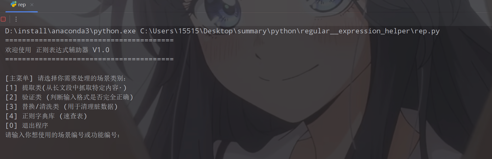
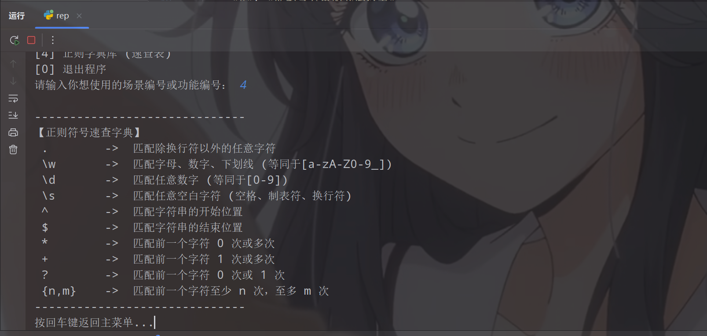
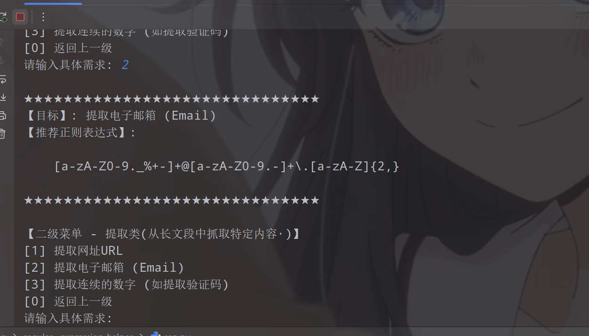
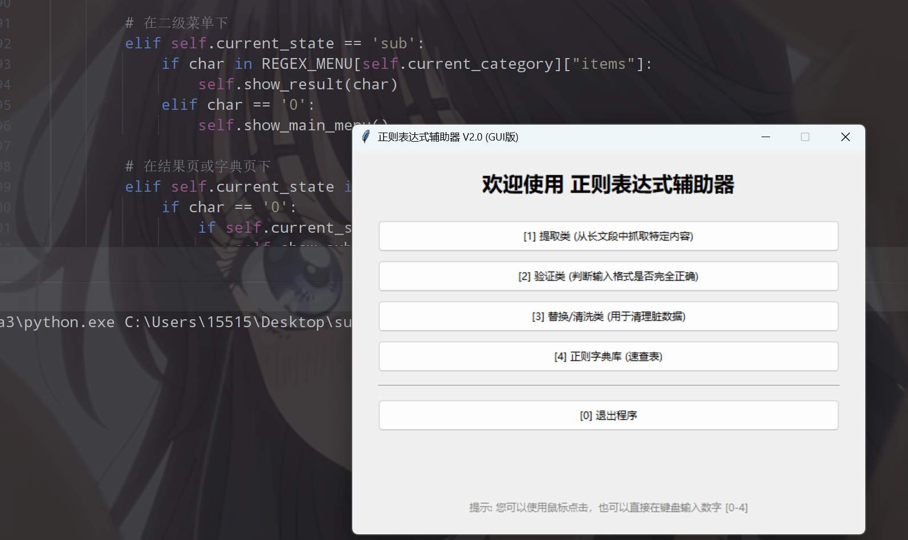
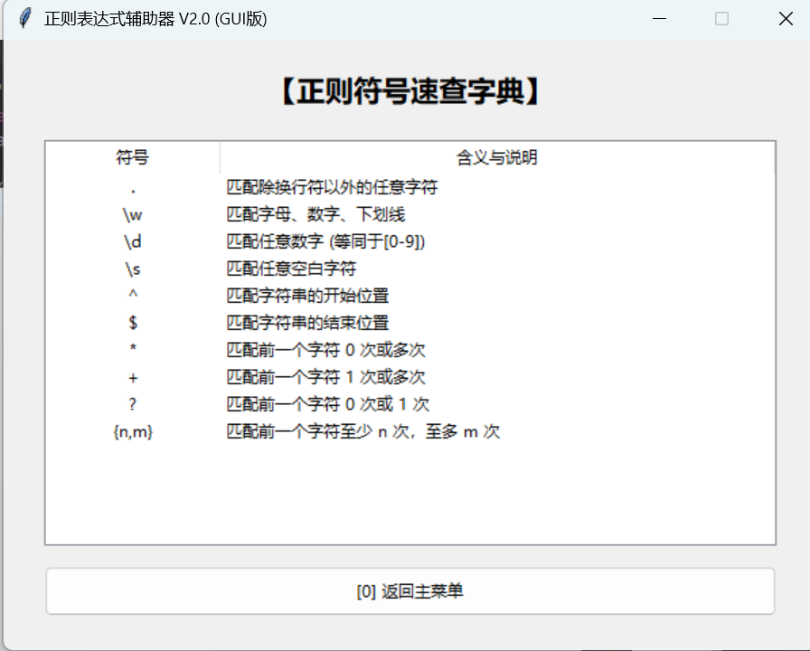

# 正则表达式辅助器 (Regex Helper) V2.0 - GUI 桌面版

---

## 项目概述 

这是一个使用 Python 编写的轻量级桌面端正则表达式辅助工具。程序内置了开发者在日常编程中最常用的正则表达式场景（涵盖数据提取、格式验证、脏数据清洗等），并提供了一键复制功能和基础正则语法速查字典。本项目适合作为个人学习 Python GUI 编程 (Tkinter) 与面向对象设计 (OOP) 的案例

---

## 版本迭代说明 (V1.0 vs V2.0)

本项目经历了从命令行到图形化界面的彻底重构，核心更新点如下：

*   **界面大换血 (CLI -> GUI)**：V1.0 运行在终端黑框中，依靠 `while` 循环和 `print` 打印菜单；V2.0 全面升级为基于 Tkinter 的现代化独立窗口程序。
*   **交互方式双倍提升**：V1.0 仅支持键盘输入数字回车确认；V2.0 实现了 **鼠标点击按钮 + 键盘敲击数字** 的无缝双重交互，保留了极速盲操体验。
*   **新增一键复制机制**：V1.0 需用户手动用鼠标框选复制终端里的正则文本；V2.0 新增了「一键复制到剪贴板」按钮，点完直接去代码里 `Ctrl+V`，大幅提高生产力。
*   **排版与架构升级**：速查字典由干瘪的文本变为整洁的电子表格（Treeview）；底层代码由面向过程的死循环架构，重构为高内聚的 **面向对象 (OOP) 事件驱动** 架构。

---

## 技术要点 

### 环境要求

- Python 3.x

### 需要安装的库

**无需 pip 安装任何第三方库**
本项目完全基于 Python 内置标准库开发，极度轻量。

### 技术栈

- **Tkinter**：Python 内置的标准 GUI 库，用于绘制窗口、标签和输入框。
- **Tkinter.ttk**：引入带主题的扩展组件库，用于渲染现代化的 Button、Separator 和 Treeview（表格）。
- **面向对象编程 (OOP)**：使用类 (`class RegexHelperApp`) 封装窗口实例、UI 渲染方法与全局状态。

---

## 核心技术实现细节

### 1. 事件驱动与键盘绑定
```python
self.root.bind('<Key>', self.on_key_press)
...
def on_key_press(self, event):
    char = event.char
    if not char.isdigit():
        return
    # 根据当前页面状态，执行对应的键盘按键逻辑...
```
- 摒弃了 V1.0 的 `input()` 阻塞等待，改为**事件驱动模式**。
- 监听全局键盘按键，结合程序内部的 `current_state` 状态机，判断当前在哪个菜单层级，从而实现光速数字键切换页面。

### 2. UI 动态渲染与路由分发
```python
for key, value in REGEX_MENU.items():
    btn_text = f"[{key}] {value['title']}"
    btn = ttk.Button(self.main_frame, text=btn_text, command=lambda k=key: self.show_sub_menu(k))
    btn.pack(...)
```
- 利用数据驱动 UI 的思想，直接遍历嵌套字典 `REGEX_MENU` 生成对应的菜单按钮。
- 使用 `lambda` 匿名函数巧妙解决了 Tkinter 按钮在循环中绑定参数时的变量闭包问题。
- 通过 `clear_frame()` 方法在页面跳转前销毁旧组件，实现单页面应用 (SPA) 般的路由切换体验。

### 3. 一键操作系统剪贴板
```python
def copy_to_clipboard():
    self.root.clipboard_clear()
    self.root.clipboard_append(target['pattern'])
    messagebox.showinfo("成功", "正则表达式已成功复制到剪贴板！")
```
- 调用 `Tk` 实例底层的 `clipboard_clear` 和 `clipboard_append` 接口，打通 Python 程序与操作系统剪贴板的通信。
- 配合弹窗组件 `messagebox` 给予用户操作成功的正向反馈。

### 4. 表格化数据的构建
```python
tree = ttk.Treeview(self.main_frame, columns=("Symbol", "Description"), show="headings")
tree.heading("Symbol", text="符号")
for sym, desc in REGEX_DICT.items():
    tree.insert("", "end", values=(sym, desc))
```
- 使用强大的 `Treeview` 控件替代了普通的字符串拼凑打印。
- 设定居中对齐、限制列宽，完美呈现“正则表达式符号与释义”这种结构化字典数据，阅读体验直线上升。

## 运行结果展示

### 1.0








### 2.0 GUI



