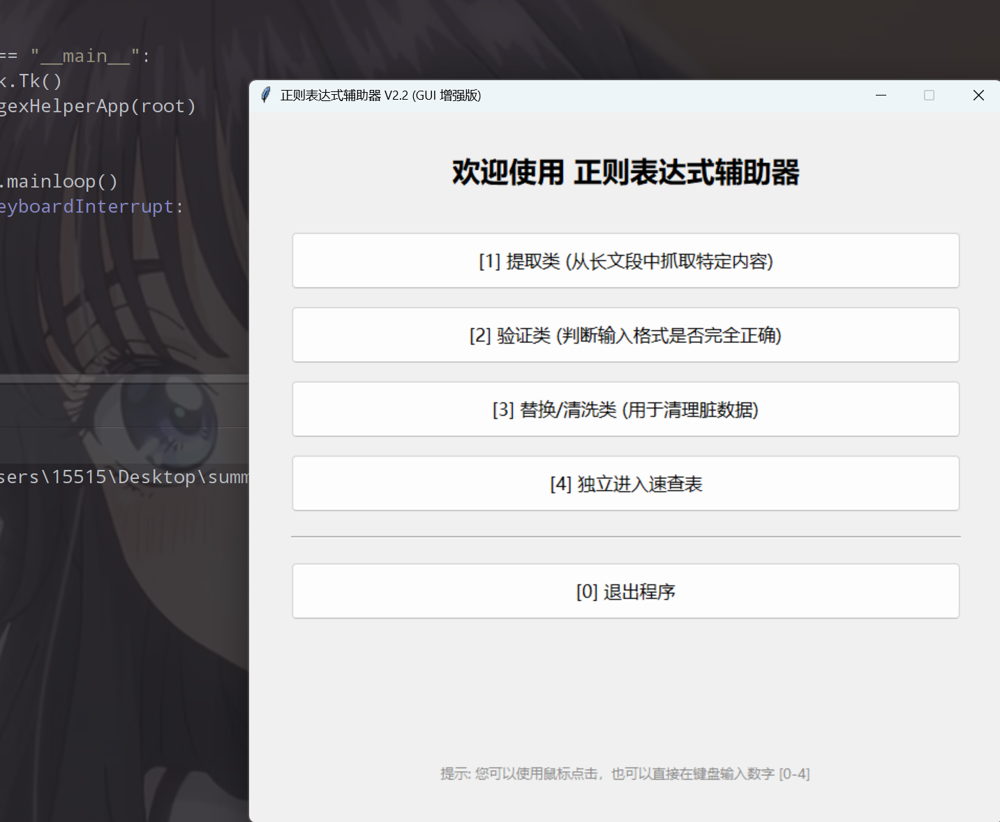
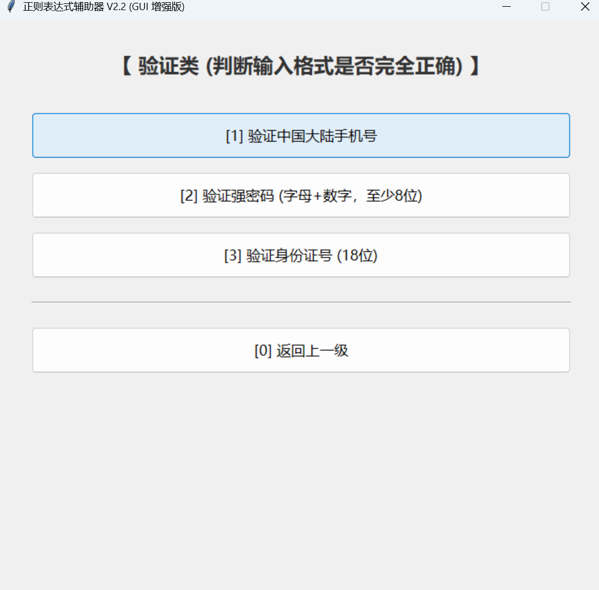
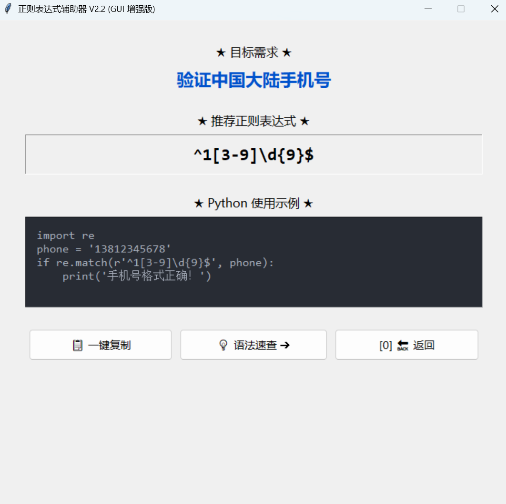
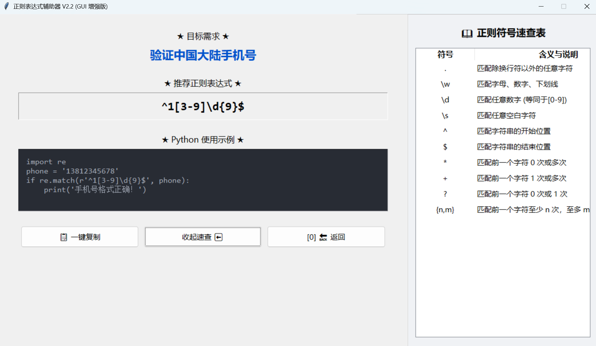
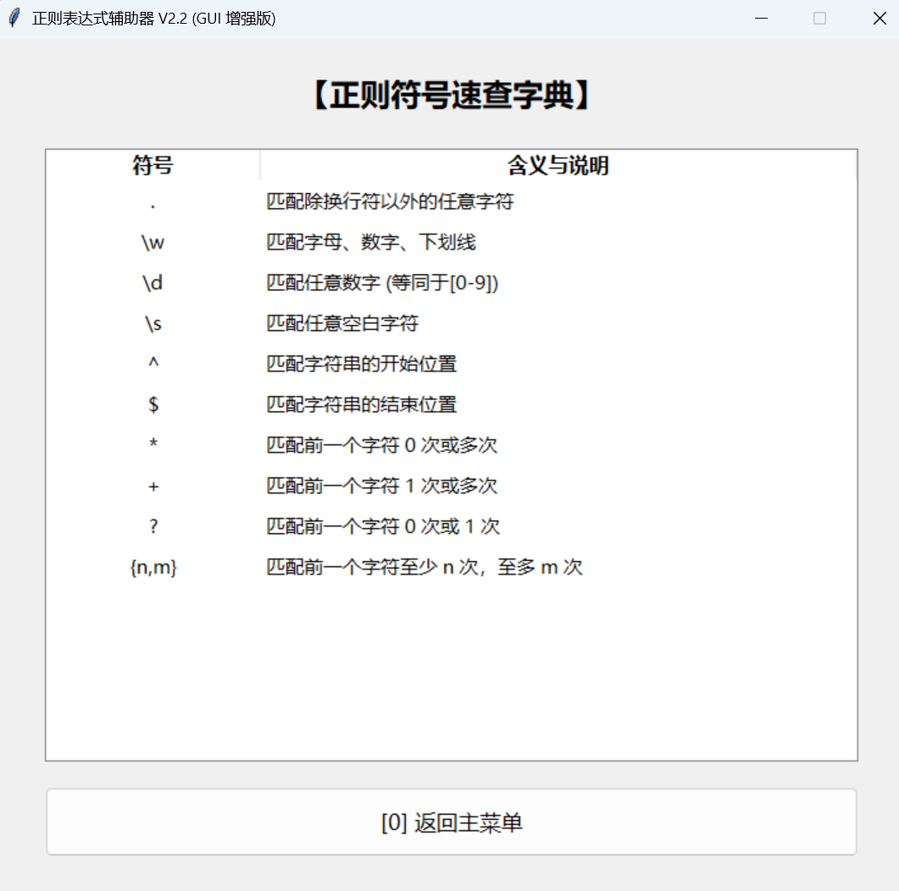

# 🧰 正则表达式辅助器 (Regex Helper) V2.2 - GUI 增强版

## 📖 项目概述
本项目是一个基于 Python 原生 `tkinter` 库开发的轻量级桌面端正则表达式辅助工具。
V2.2 版本在前期版本的基础上进行了**彻底的 UI 现代化重构与交互升级**，不仅内置了高频正则场景的表达式，还创新性地引入了“暗黑风格代码演示区”与“侧边抽屉式速查表”，旨在为开发者提供“查询-理解-复制”一站式的闭环体验。

---

## 🚀 V2.2 突破与更新点

相比于 V2.1，本次 V2.2 版本实现了以下核心突破：

1. **现代化侧边“抽屉”机制 (Drawer UI)**：打破了传统 Tkinter 弹窗满天飞的局限。在结果页右下角新增【语法速查】按钮，点击后主窗口会平滑扩展，向右侧滑出速查表，再次点击则优雅收起，极大地提升了软件的空间利用率和现代感。
2. **UI 全局缩放与重绘**：全面引入 `ttk.Style` 进行样式接管，将菜单按钮、文本字体、树状表格（Treeview）的行高进行了全局放大，告别了原生 Tkinter 紧凑拥挤的“上世纪”界面风格。
3. **等宽栅格排版 (Grid Layout)**：在底部的操作区域（一键复制、速查、返回），摒弃了简单的 `pack` 堆叠，采用了 `grid` 响应式栅格布局，实现完美的三等分对齐，界面极其严整。
4. **沉浸式代码编辑器 UI**：Python 示例代码块采用了 `#282c34` 暗黑背景配合 `Consolas` 等宽编程字体，高度还原了 VS Code 等主流 IDE 的视觉体验，并且做到了“只读但允许鼠标框选复制”的精细化控制。

---

## 🛠 技术栈
- **语言**：Python 3.x
- **GUI 框架**：Tkinter & tkinter.ttk (Python 标准库，0 依赖)
- **核心模块**：`re` (正则表达式机制展示)

---

## 💡 核心技术要点与难点攻克

本项目虽然体积小巧，但涵盖了诸多 GUI 客户端开发的经典痛点与解决方案：

### 1. 侧拉抽屉式布局的数学计算与渲染 (难点)
为了实现“右侧抽屉”效果，程序中并未新建 `Toplevel` 窗口，而是通过控制主窗口 `root` 的 `geometry` 以及内部 Frame 的挂载与卸载来实现：
```python
# 核心逻辑：动态修改窗口分辨率大小，并控制右侧 Frame 的显示/隐藏
def toggle_drawer(self):
    if self.is_drawer_open:
        self.drawer_frame.pack_forget() # 卸载组件
        self.root.geometry(f"{self.base_width}x{self.base_height}") # 缩回原尺寸
    else:
        self.drawer_frame.pack(side='right', fill='y') # 挂载组件
        self.root.geometry(f"{self.base_width + 500}x{self.base_height}") # 窗口加宽
```

**突破点**：配合 self.drawer_frame.pack_propagate(False) 锁死容器尺寸，防止被内部的 Treeview 撑变形。

### 2. Tkinter 中的 SPA (单页面应用) 路由机制

没有采用多窗口跳转，而是使用主容器 main_frame 作为画布，在每次切换菜单时执行 clear_frame：

```python
def clear_frame(self):
    for widget in self.main_frame.winfo_children():
        widget.destroy() # 销毁当前页面所有子组件，准备渲染下一页
```

实现了极其丝滑的页面跳转，内存占用始终保持在一个 Frame 的体量。

### 3. For 循环中 Lambda 闭包传参问题 (经典避坑)

在动态生成按钮菜单时，遇到 Tkinter 中经典的 lambda 变量作用域污染问题。

```python
# 错误写法：所有按钮点击都会传入最后一个 key

command=lambda: self.show_sub_menu(key) 

# 正确写法 (本项目采用)：使用默认参数强制绑定当前作用域的值

command=lambda k=key: self.show_sub_menu(k)
```

### 4. 混合布局系统的完美融合

在结果展示页 (show_result)，整个页面的上半部分需要从上往下依次堆叠（适合 pack），而底部的三个操作按钮需要横向等宽对齐（适合 grid）。
**解决方案**：为底部按钮单独建立一个 btn_frame 并用 pack 放入主页面，随后在 btn_frame 内部开启 grid 模式，并设置权重 weight=1：

```python
btn_frame.columnconfigure(0, weight=1)
btn_frame.columnconfigure(1, weight=1)
btn_frame.columnconfigure(2, weight=1)
```

### 5. 键盘事件与状态机 (State Machine) 结合

为了保留 V1.0 的极速键盘操作体验，程序引入了 current_state 状态字段（值为 main, sub, result, dict）。在 on_key_press 事件中，按键 0-4 会根据当前所处的状态，动态执行不同的路由跳转逻辑，实现了“键盘盲操”防误触机制。

## 🤝 学习总结

本项目从简单的终端命令行脚本，逐步重构为包含状态管理、组件复用、动态路由、样式自定义的成熟桌面级应用，完整实践了面向对象编程 (OOP) 在 GUI 开发中的应用价值。

## 项目运行成果

### 2.2版本









